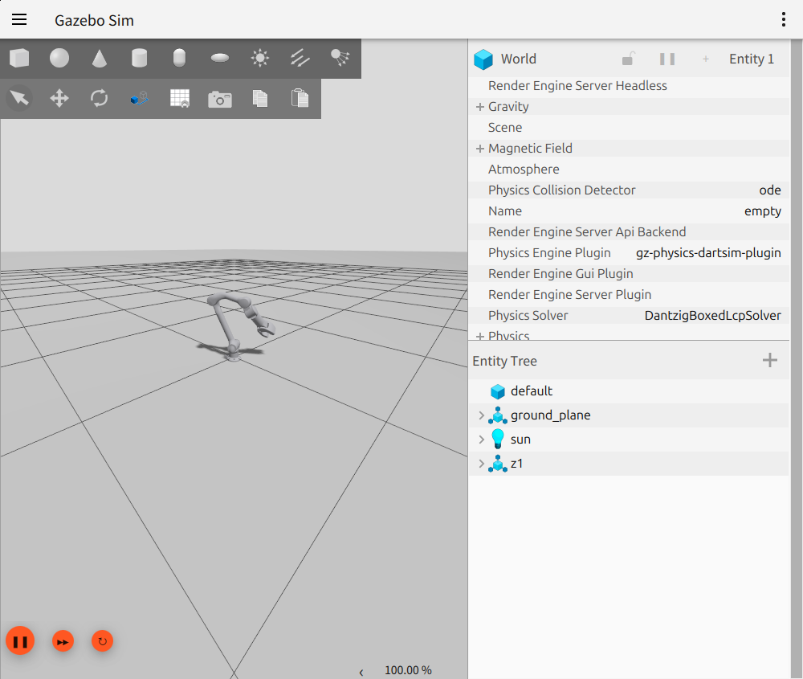
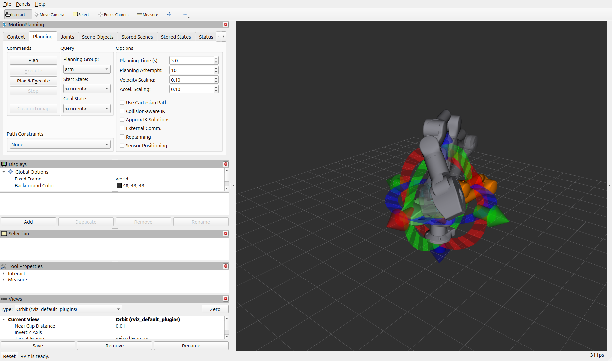

# z1_ros2_ws — Unitree Z1 的 ROS 2（Jazzy）工作空间

Unitree Z1 机械臂的 ROS 2 移植：URDF、Gazebo Sim、ros2_control 和 MoveIt 2 均已跑通，
真机（经官方 `z1_controller`）也已跑通到一个受控的小幅动作。

参数、接口、设计原因和已知限制都写在**各包自己的 README** 里，本文件只做入口。
真机的细节（依赖、启动顺序、实机实测数据、还没验证的部分）在
[`z1_ros2_control/README.md`](src/z1_ros2_control/README.md)。

## 功能包

| 功能包 | 状态 | 内容 |
|---|---|---|
| [`z1_description`](src/z1_description) | ✅ | URDF/xacro、网格模型、RViz 配置、`display.launch.py` |
| [`z1_bringup`](src/z1_bringup) | ✅ | ros2_control / Gazebo 启动、控制器配置 |
| [`z1_moveit_config`](src/z1_moveit_config) | ✅ | SRDF、运动学、关节限位、MoveIt 2 演示 |
| [`z1_controllers`](src/z1_controllers) | ✅ | 官方力矩律控制器 `Z1JointTrajectoryController`（τ = Kp·e + Kd·ė，限幅），给 Gazebo 的 effort 接口用 |
| [`z1_ros2_control`](src/z1_ros2_control) | ✅ | 真机硬件接口（官方 `z1_controller` 的 UDP 客户端）+ FSM 服务（`~/set_fsm_state`、`~/get_fsm_state`） |

## 编译

```bash
cd ~/Projects/z1_ros2_ws
source /opt/ros/jazzy/setup.bash
colcon build --symlink-install
source install/setup.bash
```

依赖均已安装；可选 `ros-jazzy-trac-ik-kinematics-plugin`（比 KDL 更好的 IK）。

## 运行

| 用途 | 命令 |
|---|---|
| 仅 URDF（RViz + 关节滑块） | `ros2 launch z1_description display.launch.py` |
| ros2_control，真机（`z1_ros2_control/Z1System`） | 先在 `~/Projects/z1_controller/build` 起 `./z1_ctrl`，再 `ros2 launch z1_bringup control.launch.py` |
| Gazebo Sim（gz 位置伺服） | `ros2 launch z1_bringup gazebo.launch.py` |
| Gazebo Sim + ros2_control | `ros2 launch z1_bringup gazebo_ros2_control.launch.py` |
| MoveIt 2 演示（仿真 + RViz） | `ros2 launch z1_moveit_config demo.launch.py` |
| MoveIt 2 演示（真机 + RViz） | `ros2 launch z1_moveit_config demo.launch.py use_gazebo:=false` |

常用参数：`use_gripper:=true|false`、`use_rviz:=true|false`、`headless:=true`（Gazebo）、
`world:=<file>`、`gz_verbosity:=0..4`。

**本机机械臂没有末端执行器时**，所有涉及模型的命令都加 `use_gripper:=false`——它会把
URDF、SRDF 和控制器映射一起切到 6 轴无夹爪版本（两种配置的默认值都是 `true`）。
Gazebo + ros2_control 默认按**官方力矩律**驱动机械臂（[`z1_controllers`](src/z1_controllers)
走 effort 接口，增益 300/5，限幅 = URDF effort）；真机路径仍是位置接口 +
`joint_trajectory_controller`。要回到位置伺服：
`controllers_file:=$(ros2 pkg prefix z1_bringup)/share/z1_bringup/config/z1_controllers.yaml`。

快速验证：

```bash
# 轨迹（真机 / gz_ros2_control 两条路径均可）
ros2 action send_goal /joint_trajectory_controller/follow_joint_trajectory \
  control_msgs/action/FollowJointTrajectory \
  "{trajectory: {joint_names: [joint1, joint2, joint3, joint4, joint5, joint6],
    points: [{positions: [0.5, 0.5, -0.4, 0.3, 0.2, 0.1],
              time_from_start: {sec: 2, nanosec: 0}}]}}" --feedback

# 夹爪；0 = 闭合，负值 = 张开
ros2 action send_goal /gripper_controller/gripper_cmd \
  control_msgs/action/GripperCommand "{command: {position: -0.8, max_effort: 10.0}}"

# 单关节，仅 Gazebo gz-servo 路径可用
ros2 topic pub --once /joint1/cmd_pos std_msgs/msg/Float64 "{data: 0.6}"
```

## 效果

| Gazebo Sim（`gazebo.launch.py`） | MoveIt 2（`z1_moveit_config demo.launch.py`） |
|---|---|
|  |  |

## 设计要点

* **一份 URDF，两种 ros2_control 后端**：`hardware_plugin:=` 选
  `z1_ros2_control/Z1System`（真机，默认）或 `gz_ros2_control/GazeboSimSystem`；
  控制器集合与 MoveIt 配置完全一致。
* **Gazebo 后端用 `effort` 接口，其余用 `position`**（`z1_ros2_control.xacro` 自动切）：
  gz_ros2_control 的位置接口只有单一 P 增益、没有 D，会跟关节摩擦形成持续抖动。
* **`use_gripper` 贯穿三层**（URDF、SRDF + 控制器映射、`gripper_controller` spawner），
  三处必须同值，否则 MoveIt 会引用模型里不存在的 link。
* **[`control.launch.py`](src/z1_bringup/launch/control.launch.py) 是共用核心**，真机、
  Gazebo、MoveIt 的启动文件都组合它；两条 Gazebo 路径（gz 伺服 + bridge、
  gz_ros2_control）相互独立，不能同时运行。
* **真机上关节级伺服律留在 `z1_controller` 内部**，ros2_control 只下发位置指令。
  真机路径需要先手动起官方 `z1_ctrl` 进程（顺序和要求见
  [`z1_ros2_control/README.md`](src/z1_ros2_control/README.md)）。

## 踩坑结论

细节与实测数据见各包 README 和代码注释，这里只留结论：

1. `gripperStator` 的 joint 与 link 同名会让 `gz sim` 拒绝加载 → 固定关节改名
   `gripperStator_joint`。
2. Blender 导出的 DAE 材质在 gz/assimp 路径上丢失 → 每个 visual 显式写 `<material>`。
3. 零位/停放位姿与官方圆柱碰撞体互穿 8 mm → SRDF 中禁用 `link02`–`link06` 碰撞对。
4. `gz_ros2_control` 的 `position_proportional_gain` 写进 URDF `<plugin>` 传不到插件，
   必须写进参数文件。
5. `IncludeLaunchDescription` 会把 `launch_arguments` 泄漏到父作用域（见 `demo.launch.py`
   注释）。
6. MoveIt 的起始状态检查很苛刻：`allowed_start_tolerance` 设为 0.05；零位正好压在 joint2
   下限 / joint3 上限上，控制器激活后先限速滑到 SRDF 的 `forward` 位姿再等规划。
7. 官方命名位姿不能照抄：`home`/`startFlat` 压在 joint2 下限上，`stow` 的 joint4 超出官方
   ±87° 限位 0.052 rad，只有 `forward` 完整落在限位内——停靠位姿因此用官方 `forward`。

真机调试新出的几条（细节与实测数据见
[`z1_ros2_control/README.md`](src/z1_ros2_control/README.md)）：

8. **ros2_control 只在组件 ACTIVE 之后才调 `read()`/`write()`**
   （`AsyncComponentThread` 里显式判 lifecycle 状态）。把"等第一帧 RecvState 再发
   `SendCmd`"的握手放进 `read()` 就是死锁——激活永远超时。I/O 必须收进一个
   `pump_once()`，由生命周期回调在激活期间自己驱动。
9. URDF 里的 `rw_rate="500"` **不生效**：异步工作线程按 controller_manager 的
   `update_rate` 跑。实机实测 `read()` 为 250 Hz，`z1_ctrl` 接受（它进入 joint space
   control 并保持），所以两者故意保持解耦。
10. 真机六个关节常驻 `error=0x40`，而 vendored 头里该位注释是 "nothing"——
    `kErrorMask` 排除它是对的；若当地真故障，真机一帧都用不了。
11. **joint2 是双电机关节**（每个 `JointState` 有两组 `Motor_State`），其余只有第一组；
    且无夹爪时第 7 个电机槽不能参与故障判定（否则健康 6 轴臂每周期 ERROR）。
12. `joint_trajectory_controller` 的单点轨迹里 `positions` 是**绝对**目标，不是增量：
    想动一个关节，必须把其余关节的当前位置一并写进轨迹点。
13. mock 写好了不等于能跑：`z1_ctrl_mock.py` 有两个致命 bug（`finally:` 里的 `return`
    吞掉所有异常；`build_reply()` 少打包 3 个字段），使它在"跑通"的样子下一包都发不
    出去。异常路径与返回值核对必须在接真机前做完。

## 来源 / 许可证

网格模型、惯量和关节限位来自
[`unitreerobotics/unitree_ros`](https://github.com/unitreerobotics/unitree_ros)
（`robots/z1_description`，**BSD-3-Clause**，© Unitree Robotics），
详见 `src/z1_description/LICENSE`。与 ROS 1 原版的差异列在
`src/z1_description/README.md` 中。
